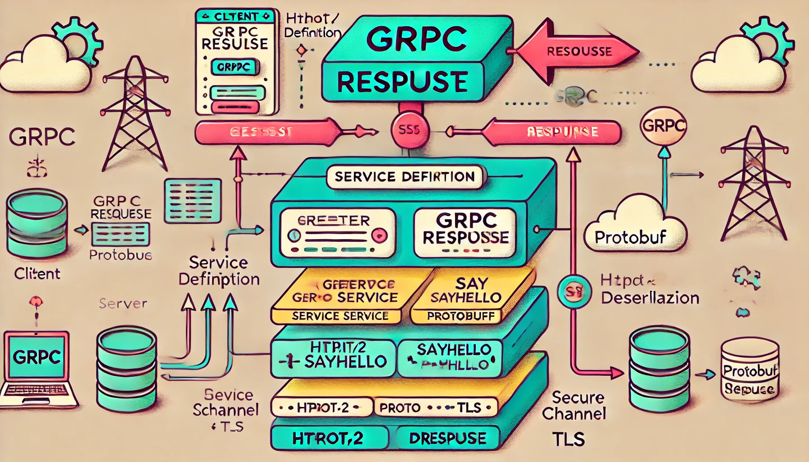
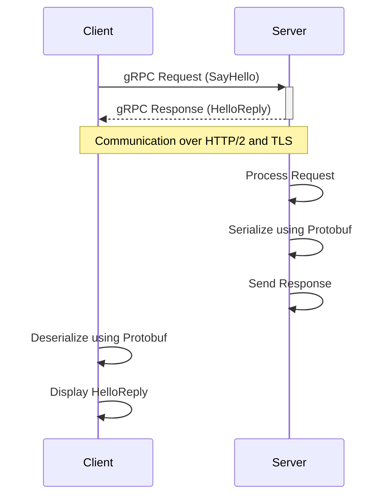

# gRPC



gRPC, mikroservis mimarisinde yüksek performanslı, dil bağımsız ve etkili bir uzaktan prosedür çağrısı (RPC) protokolüdür. gRPC, özellikle düşük gecikme süresi ve yüksek verim gerektiren dağıtık sistemlerde tercih edilir.



## 1. **gRPC Nedir?**

- **gRPC**: Google tarafından geliştirilen ve HTTP/2 protokolü üzerinde çalışan, uzaktan prosedür çağrılarını (RPC) destekleyen bir framework'tür.
- **Protobuf (Protocol Buffers)**: gRPC'de kullanılan varsayılan veri serileştirme formatıdır. gRPC'de mesajlar bu formatta tanımlanır ve serileştirilir, bu da performansı artırır.
- gRPC ile iki sistem arasında bir istemci-sunucu (client-server) modelinde iletişim sağlanır. İstemci, sunucunun metodlarını çağırabilir ve sunucu bu çağrılara yanıt verir.

---

## 2. **gRPC Kurulumu (C# için .NET Core Örneği)**

### a) .NET Core Projesi Oluşturma

gRPC kullanmak için bir .NET Core uygulaması oluşturabilirsiniz. İlk olarak, bir gRPC sunucusu ve istemcisi geliştirmek için gerekli adımlara göz atalım.

#### Sunucu Projesi Kurulumu

1. **Yeni gRPC projesi oluşturun**:

   ```bash
   dotnet new grpc -o GrpcServer
   cd GrpcServer
   ```

   Bu komut, `GrpcServer` adında bir gRPC projesi oluşturur. Bu şablon, varsayılan olarak bir `GreeterService` içerir.

2. **Proje dosyası (csproj) içinde gerekli bağımlılıkları kontrol edin**:
   `Grpc.AspNetCore` paketinin eklendiğinden emin olun. Proje şablonu bunu varsayılan olarak içerecektir.

   ```xml
   <PackageReference Include="Grpc.AspNetCore" Version="2.37.0" />
   ```

#### İstemci Projesi Kurulumu

1. **Yeni istemci projesi oluşturun**:

   ```bash
   dotnet new console -o GrpcClient
   cd GrpcClient
   ```

2. **gRPC istemcisi için gerekli bağımlılıkları ekleyin**:
   İstemci projesinde `Grpc.Net.Client` paketini ekleyin:

   ```bash
   dotnet add package Grpc.Net.Client
   dotnet add package Google.Protobuf
   dotnet add package Grpc.Tools
   ```

---

## 3. **Protobuf Dosyası ve gRPC Metodları**

gRPC'nin merkezinde, servis tanımları ve veri yapılarını içeren bir `.proto` dosyası bulunur. gRPC servisleri bu dosyada tanımlanır.

### a) `protos/greeter.proto` Dosyası

`Greeter` servisi için bir örnek `.proto` dosyası aşağıdaki gibi olabilir:

```protobuf
syntax = "proto3";

option csharp_namespace = "GrpcServer";

package greet;

// Greeter service tanımı
service Greeter {
  // Bir metod tanımlayın: SayHello
  rpc SayHello (HelloRequest) returns (HelloReply);
}

// HelloRequest mesajı
message HelloRequest {
  string name = 1;
}

// HelloReply mesajı
message HelloReply {
  string message = 1;
}
```

Bu `.proto` dosyasında:

- **Servis**: `Greeter` adlı bir servis tanımlıyoruz.
- **RPC Metodu**: `SayHello` adlı bir RPC metodu tanımlıyoruz, bu metod bir `HelloRequest` alır ve bir `HelloReply` döner.
- **Mesajlar**: `HelloRequest` ve `HelloReply` mesajları, gRPC'nin sunucu ile istemci arasında ileteceği veri yapılarıdır.

---

## 4. **Sunucu Tarafında gRPC Metodlarını Uygulama**

Sunucu tarafında bu metodun nasıl işleneceğini tanımlamanız gerekir. `GreeterService.cs` dosyasını güncelleyerek sunucu tarafındaki işleyişi tanımlayabiliriz.

### a) `GreeterService.cs` Dosyası

```csharp
using Grpc.Core;
using System.Threading.Tasks;

namespace GrpcServer
{
    public class GreeterService : Greeter.GreeterBase
    {
        // SayHello metodunu implement ediyoruz
        public override Task<HelloReply> SayHello(HelloRequest request, ServerCallContext context)
        {
            return Task.FromResult(new HelloReply
            {
                Message = $"Hello, {request.Name}"
            });
        }
    }
}
```

Bu sınıf, `GreeterBase` sınıfını genişletir ve `SayHello` metodunu implement eder. İstemciden gelen isteğe yanıt olarak bir `HelloReply` döner.

### b) Sunucu Başlatma (`Program.cs`)

`Program.cs` içinde, gRPC sunucusunu başlatmamız gerekir. `Startup.cs` dosyasında gerekli yapılandırmayı yapıyoruz:

```csharp
public class Startup
{
    public void ConfigureServices(IServiceCollection services)
    {
        services.AddGrpc();
    }

    public void Configure(IApplicationBuilder app, IWebHostEnvironment env)
    {
        app.UseRouting();

        app.UseEndpoints(endpoints =>
        {
            endpoints.MapGrpcService<GreeterService>();
        });
    }
}
```

---

## 5. **İstemci Tarafında gRPC Çağrıları**

İstemci, sunucuya bağlanıp metodları çağırabilir. İstemci tarafında `Program.cs`'yi güncelleyerek sunucuya bağlanma ve `SayHello` metodunu çağırma işlemini yapalım.

### a) `Program.cs` Dosyası (İstemci)

```csharp
using Grpc.Net.Client;
using System;
using System.Threading.Tasks;

namespace GrpcClient
{
    class Program
    {
        static async Task Main(string[] args)
        {
            // Sunucuya bağlanma
            var channel = GrpcChannel.ForAddress("https://localhost:5001");
            var client = new Greeter.GreeterClient(channel);

            // SayHello metodunu çağırma
            var reply = await client.SayHelloAsync(new HelloRequest { Name = "World" });

            Console.WriteLine("Greeting: " + reply.Message);
        }
    }
}
```

Bu kodda:

- `GrpcChannel` nesnesi ile sunucuya bağlanıyoruz.
- Sunucudaki `SayHello` metodunu çağırıyoruz ve cevabı yazdırıyoruz.

---

## 6. **Proje Çalıştırma**

### a) Sunucu Başlatma

Sunucuyu çalıştırmak için:

```bash
dotnet run --project GrpcServer
```

Sunucu, varsayılan olarak `https://localhost:5001` üzerinde çalışacaktır.

### b) İstemciyi Çalıştırma

İstemciyi çalıştırmak için:

```bash
dotnet run --project GrpcClient
```

Sonuç olarak istemci sunucuya bağlanacak ve `"Hello, World"` cevabını alacaktır.

---

## 7. **Sonuç ve Özet**

gRPC, mikroservis mimarisinde yüksek performanslı ve ölçeklenebilir iletişim sağlayan güçlü bir araçtır. HTTP/2 ve Protobuf sayesinde hızlı, verimli ve güvenilir bir iletişim sağlar. Senkron ve asenkron RPC çağrıları, gRPC'nin esnek yapısı ile kolayca yönetilebilir.

- **Protobuf** dosyaları ile veri yapıları ve servis metodları tanımlanır.
- **gRPC Sunucusu**, bu metodları işleyerek yanıt döner.
- **gRPC İstemcisi**, sunucuya bağlanarak bu metodları çağırır.

gRPC, dil bağımsız çalıştığı için farklı platformlarda (.NET, Java, Go, Python vb.) kolayca kullanılabilir ve mikroservislerin sorunsuzca haberleşmesini sağlar.
